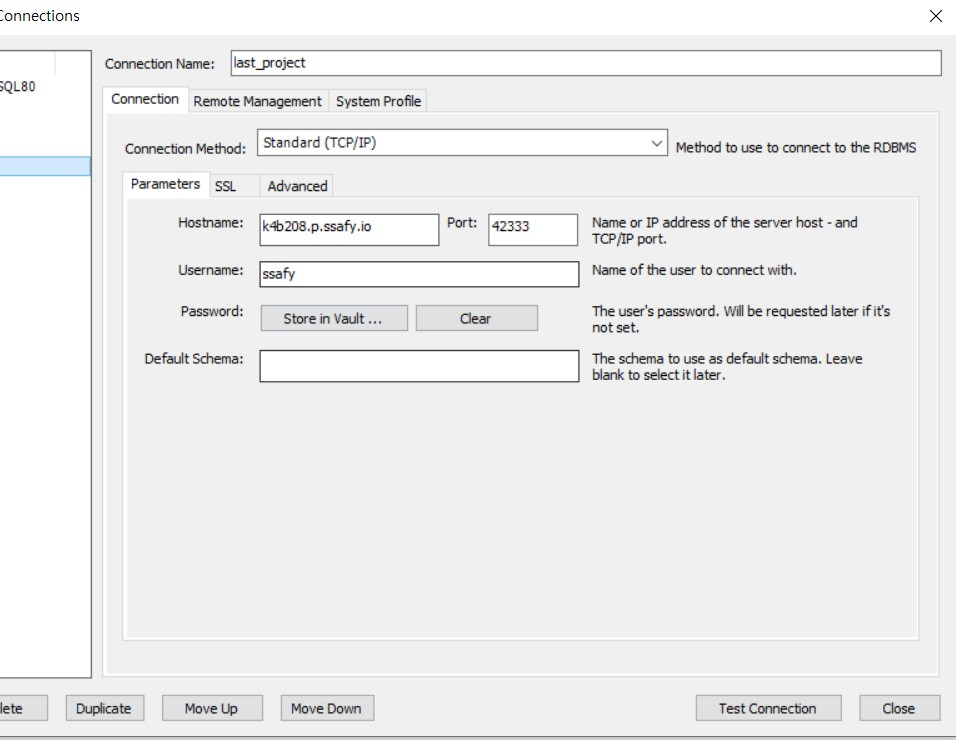
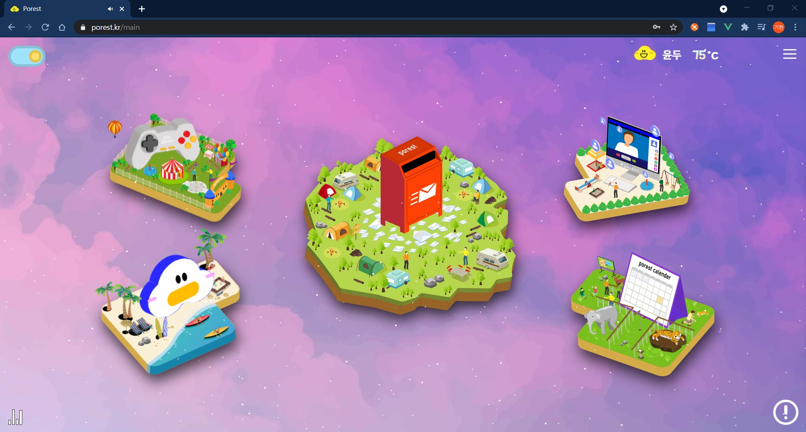

# Porest 배포 가이드 문서


### 1. 환경

| 이름        | 구성        | 버전                                               | 비고 |
| ----------- | ----------- | -------------------------------------------------- | ---- |
| main server | EC2         | Ubuntu 20.04 LTS (GNU/Linux 5.4.0-1018-aws x86_64) |      |
| live server | EC2         | Ubuntu 20.04 LTS (GNU/Linux 5.4.0-1018-aws x86_64) |      |
| frontend    | Vue.js      | vue : 2.6.11<br />node js : 6.14.8                 |      |
| backend     | Spring Boot | java : 11<br />gradle : 6.8.9<br />spring : 2.3.9  |      |


### 2. 서버 세팅

* **Docker 설치**

  ```bash
  #도커 패키지 설치 전 업데이트 수행
  $ sudo apt-get update
  
  #도커 패키지 설치
  $ sudo apt-get install apt-transport-https ca-certificates curl gnupg-agent software-properties-common
  
  #도커GPG 키 추가
  $ curl -fsSL https://download.docker.com/linux/ubuntu/gpg | sudo apt-key add -
  
  #도커 GPG 키 확인
  $ sudo apt-key fingerprint 0EBFCD88
  
  #터미널에서 아래와 같이 뜨면 OK
  ====================================================================
  pub   rsa4096 2017-02-22 [SCEA]
        9DC8 5822 9FC7 DD38 854A  E2D8 8D81 803C 0EBF CD88
  uid           [ unknown] Docker Release (CE deb) <docker@docker.com>
  sub   rsa4096 2017-02-22 [S]
  ====================================================================
  
  
  
  #docker 저장소 등록
  $ sudo add-apt-repository "deb [arch=amd64] https://download.docker.com/linux/ubuntu $(lsb_release -cs) stable"
  
  #docker engine 설치
  $ sudo apt-get update
  sudo apt-get install docker-ce docker-ce-cli containerd.io
  
  #docker engine 설치 확인
  $ sudo docker run hello-world
  
  #아래와 같이 나왔다면 설치 성공
  ====================================================================
  Hello from Docker!
  This message shows that your installation appears to be working correctly.
  
  To generate this message, Docker took the following steps:
   1. The Docker client contacted the Docker daemon.
   2. The Docker daemon pulled the "hello-world" image from the Docker Hub.
      (amd64)
   3. The Docker daemon created a new container from that image which runs the
      executable that produces the output you are currently reading.
   4. The Docker daemon streamed that output to the Docker client, which sent it
      to your terminal.
  
  To try something more ambitious, you can run an Ubuntu container with:
   $ docker run -it ubuntu bash
  
  Share images, automate workflows, and more with a free Docker ID:
   https://hub.docker.com/
  
  For more examples and ideas, visit:
   https://docs.docker.com/get-started/
  ====================================================================
  ```

  

* **Docker compose 설치**

  ```bash
  #안정적인 버전인 1.29.1 설치
  $ sudo curl -L "https://github.com/docker/compose/releases/download/1.29.1/docker-compose-$(uname -s)-$(uname -m)" -o /usr/local/bin/docker-compose
  
  #docker compose 권한 적용
  $ sudo chmod +x /usr/local/bin/docker-compose
  
  #docker compose 버전 확인
  $ docker-compose --version
  
  ```

  

* **SSL 인증서 발급**

  ```bash
  # 만약에 nginx 등 서버를 열어놨다면 꼭 끄고 하기
  $ sudo apt update
  $ sudo apt-get install letsencrypt -y
  $ certbot certonly --standalone -d 사이트명( 사이트명2 사이트명3 ...)
  ```


* **사이트명에 맞게 conf 수정**

   **ex) main 서버 proxy.conf**

  ```yaml
  # proxy directory -> proxy.conf
  # proxy conf
  # ! 수정이라고 적힌 부분은 모두 수정해야합니다.
  
  server {
    listen 80;
    #server_name 수정
    server_name k4b208.p.ssafy.io;
    
    #본인의 domain으로 수정
    return 301 https://porest.kr$request_uri;
  }
  
  server {
    listen 80;
    #server_name 수정
    server_name 13.209.85.224;
    
    #본인의 domain으로 수정
    return 301 https://porest.kr$request_uri;
  }
  server {
   listen 443 ssl;
    
    #server_name 수정
    server_name k4b208.p.ssafy.io;
  
    #live/ 뒤에 주소 수정
    ssl_certificate /etc/letsencrypt/live/k4b208.p.ssafy.io/fullchain.pem;
    ssl_certificate_key /etc/letsencrypt/live/k4b208.p.ssafy.io/privkey.pem;
  
    ssl_protocols TLSv1 TLSv1.1 TLSv1.2;
    ssl_ciphers HIGH:!aNULL:!MD5;
    
    location / {
      #본인의 domain 주소로 변경
      return 301 https://porest.kr$request_uri;
    }
  }
  server {
    listen 80;
  
    #본인의 domain 주소로 변경
    server_name porest.kr;
    
    #본인의 domain 주소로 변경
    return 301 https://porest.kr$request_uri;
  }
  server {
    listen 443 ssl;
  
    #본인의 domain 주소로 변경
    server_name porest.kr;
    
    #live/ 뒤에 주소 수정
    ssl_certificate /etc/letsencrypt/live/porest.kr/fullchain.pem;
    ssl_certificate_key /etc/letsencrypt/live/porest.kr/privkey.pem;
    
    ssl_protocols TLSv1 TLSv1.1 TLSv1.2;
    ssl_ciphers HIGH:!aNULL:!MD5;
    
    #엑세스 로그, 오류 로그를 남길 파일 경로 지정
    access_log /var/log/nginx/access.log;
    error_log /var/log/nginx/error.log;
    
    #static pages root & index 설정
    root /var/www/html;
    index index.html index.htm;
    
    location / {
      proxy_intercept_errors on;
      try_files $uri $uri/ /index.html;
    }
    
    #jenkins server 접근
    location /jenkins {
      proxy_set_header Host $host:$server_port;
      proxy_set_header X-Real-IP $remote_addr;
      proxy_set_header X-Forwarded-For $proxy_add_x_forwarded_for;
      proxy_set_header X-Forwarded-Proto $scheme;
      proxy_redirect off;
      proxy_pass http://jenkins:8080;
      # Required for new HTTP-based CLI
      proxy_http_version 1.1;
      proxy_request_buffering off;
      proxy_buffering off; # Required for HTTP-based CLI to work over SSL
      # workaround for https://issues.jenkins-ci.org/browse/JENKINS-45651
    }
  
    #restAPI server 접근
    location /api {
      rewrite /api/(.*) /api/$1 break;
      proxy_pass http://spring:8081;
      proxy_set_header X-Real-IP $remote_addr;
      proxy_set_header X-Forwarded-For $proxy_add_x_forwarded_for;
      proxy_set_header Host $http_host;
   }
  }
  ```

  * main 서버와 live 서버 모두 `docker 설치`부터  `SSL 인증서 발급`까지는 동일하게 진행합니다.
  * `porxy.conf` 수정은 따로 해주셔야 합니다.


### 3. Main 서버 실행

* **main 서버 rest API build 하기**

  ```bash
  $ sudo docker build --tag porest:latest .
  ```

* main 서버 실행

  ```bash
  $ sudo docker-compose up -d
  ```


### 4. Live 서버 실행

* **live 서버 webRTC 서버 build 하기**

  ```bash
  $ sudo docker build --tag live:latest .
  ```

* **live 서버 실행**

  ```bash
  $ sudo docker-compose up -d
  ```

  


### 5. DB

* DB는 서버에서 외부 포트를 따로 주고 `MySQL Workbench`로 설정하는 방식을 사용했습니다.

* docker에 올라간 MySQL DB 외부 포트 :  `42333`
* `root username` : `ssafy`
* `root password` : `hansuproot1!@#`




* `db` directory를 불러와 `import`를 진행합니다.


### 6. 최종 확인

* main 서버 : https://porest.kr
  * 아래와 같이 UI가 떠야 정상
* live 서버 : https://live.porest.kr
  * 그냥 접속하면 Cannot GET /이 뜨면 정상

