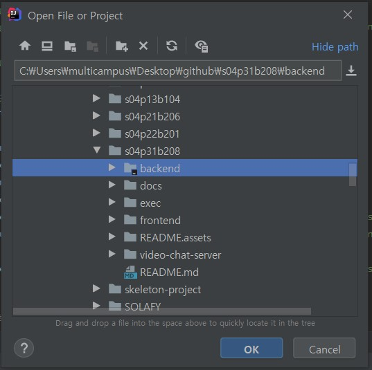
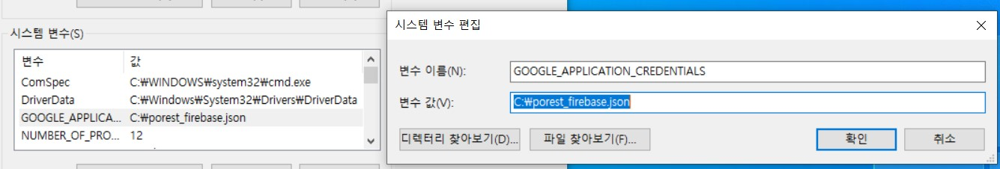
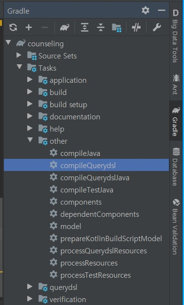
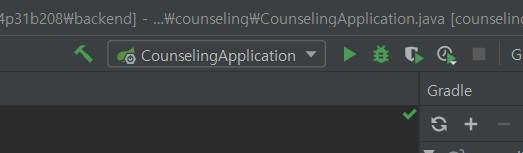
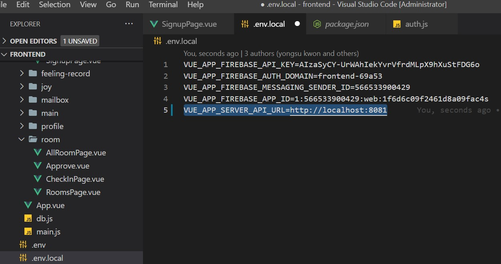
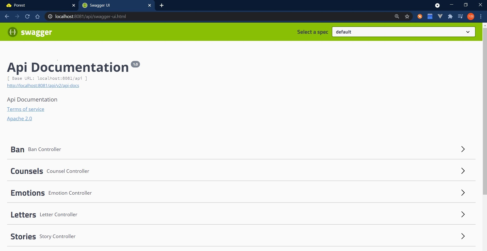
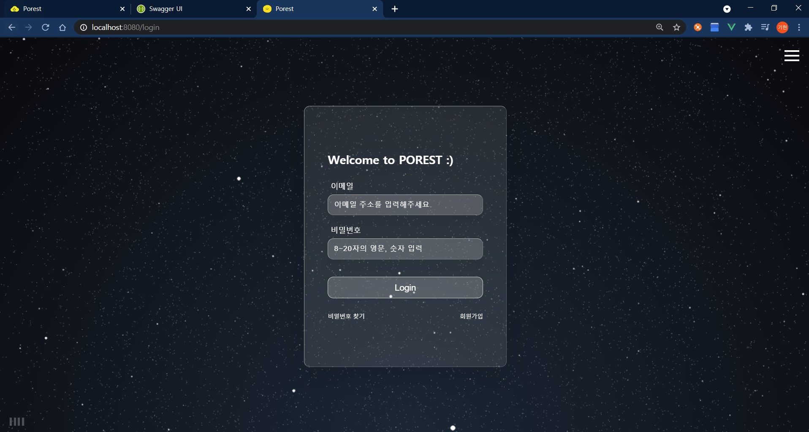

# Porest 포팅 가이드 문서


### 1. 환경

| 이름        | 구성        | 버전                                               | 비고 |
| ----------- | ----------- | -------------------------------------------------- | ---- |
| main server | EC2         | Ubuntu 20.04 LTS (GNU/Linux 5.4.0-1018-aws x86_64) |      |
| live server | EC2         | Ubuntu 20.04 LTS (GNU/Linux 5.4.0-1018-aws x86_64) |      |
| frontend    | Vue.js      | vue : 2.6.11<br />node js : 6.14.8                 |      |
| backend     | Spring Boot | java : 11<br />gradle : 6.8.9<br />spring : 2.3.9  |      |


### 2.  DB

* `db` directory를 불러와 `import`를 진행합니다.


### 3. backend

> intellij 기준으로 작성되었습니다.



* spring boot 프로젝트를  `import` 한 후, 

* `application.yaml`을 resources아래 만들고 아래 코드를 복사합니다.

  ```yaml
  server:
    port: 8080
    servlet:
      contextPath: /api
  
  spring:
    profiles:
      active: local
    application:
      name: back-api
    datasource:
      driver-class-name: com.mysql.cj.jdbc.Driver
      url: jdbc:mysql://localhost:3306/hansup?useUniCode=yes&characterEncoding=UTF-8&serverTimezone=Asia/Seoul
      username: ssafy
      password: hansupssafy1!@#
      dialect: org.hibernate.dialect.MySQL8Dialect
    jpa:
      showSql: true
      hibernate:
        ddl-auto: update
      properties:
        hibernate:
          format_sql: true
    #mail
    mail:
      host: smtp.gmail.com
      port: 587
      username: porest.help@gmail.com
      password: porest123!@#
      properties.mail.smtp:
        auth: true
        starttls.enable: true
  
    #redis
    cache:
      type: redis
    redis:
      host: porest.kr
      port: 42334
    data:
      redis:
        repositories:
          enabled: false
  
  logging:
    level:
      org:
        hibernate:
          type:
            descriptor:
              sql: trace
  
  jwt:
    secret: ILOVEPOREST_ODvkvcbdsSDF23jbxc#@xdfvml2SDFv0b=ckdsikwjcBCxbodjqw^dmSDc
  ```


* `firebase-admin`을 이용하기 위해 환경변수를 등록합니다.

  > `porest_firebase.json`은 `exec/infra/main_server/keys`경로 아래에 있습니다.

  ```
  변수 이름 : GOOGLE_APPLICATION_CREDENTIALS
  변수 값 : porest_firebase.json을 원하는 경로에 복사하고 해당 경로를 넣어주세요.
  ```

  


* `queryDSL`을 `Gradle` 탭에서 컴파일 합니다.(더블 클릭)




* 빌드를 진행합니다.(망치 버튼 클릭)
* 서버를 실행합니다. (재생 버튼 클릭)




### 4. Frontend

* .env파일의 `VUE_APP_SERVER_API_URL`을 아래와 같이 수정합니다. 

  ```
  VUE_APP_SERVER_API_URL=http://localhost:8081
  ```

  

  * 원래 `https://porest.kr`로 되어있습니다.


* 라이브러리 설치(node js는 설치가 되어 있어야 합니다)

  ```cmd
  npm install
  ```

* 서버 실행

  ```cmd
  npm run serve
  ```


### 5. 최종 확인

* backend : http://localhost:8081/api/swagger-ui.html

  

  

* frontend : https://localhost:8080

  

