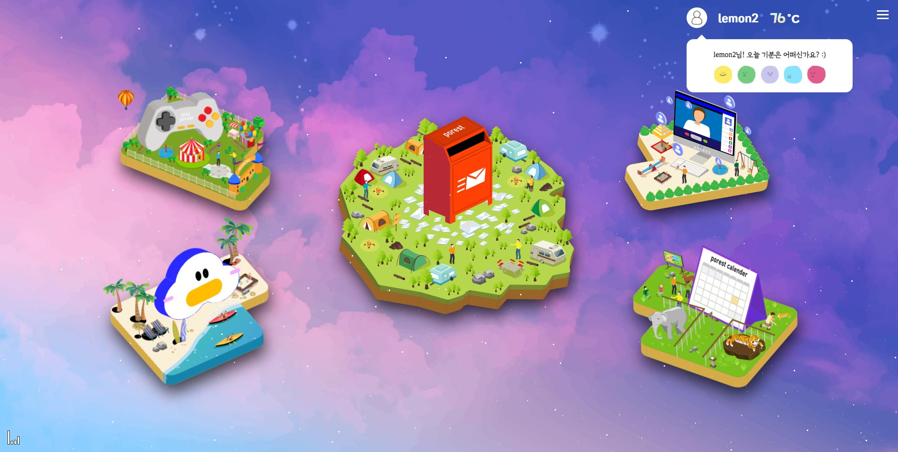
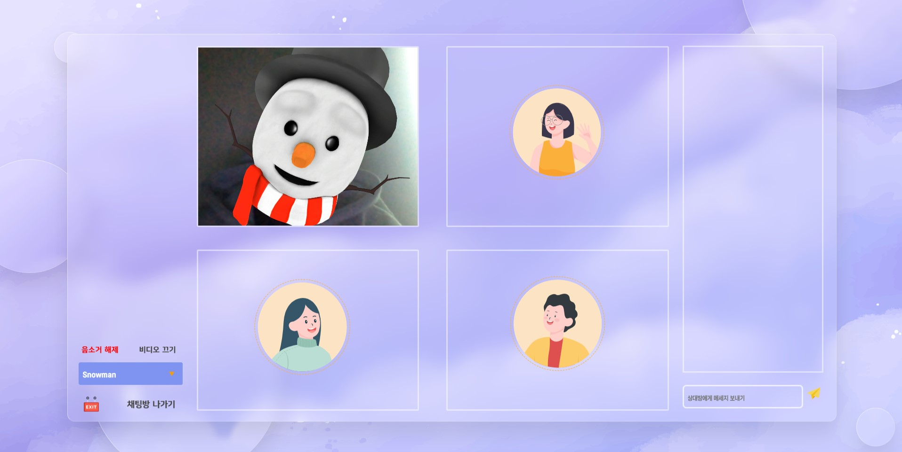

# 🏠 [Porest](https://www.notion.so/API-b6ac4e75f4bf4e859684b0eb489afa08)

[ SSAFY 자율프로젝트 ]	2021. 04.12 ~ 2021.05.28

<br /><br />

## 1. 	🤞팀소개

- **Guardians of the POREST [대전2반_B208]**

|   Name   | 강민지                         | 권용수                        | 김종성                        | 윤기현                        | 정시은                        |
| :------: | ------------------------------ | ----------------------------- | ----------------------------- | ----------------------------- | ----------------------------- |
| Profile  |   |  |  |  |  |
| Position | 프론트엔드<br />일러스트레이터 | 프론트엔드<br />인터렉션      | 백엔드<br />DB설계            | 백엔드<br />인프라            | 프론트엔드<br />UI/UX         |
| Nickname | 강모라                         | 권맥스                        | 김타로드                      | 윤두                          | 정뷸라                        |

- POREST를 지키는 수호자입니다.


## 2. 🤘 프로젝트 소개

### 1. 주제

#### 	'지치고 힘든 사람들을 위한 소통의 공간'

#### 	'마음을 터놓을 수 있는 따뜻한 공간'

<br /><br />

### 2. 선정 배경 및 시장 분석

* **2-1. 기술/트렌드 동향**

  ‘코로나 블루’라고 불릴 정도로 코로나19로 인한 정신건강문제가 심각한 수준에 이르자, 정부가 종합대책을 마련했다. 정부는 정세균 국무총리 주재 국정현안점검조정회의에서 ‘온국민 마음건강 종합대책(제2차 정신건강복지기본계획)’을 논의하고, 코로나19 극복과 전 국민 정신건강 증진을 위해 향후 5년간 정신건강 분야에서 국가책임과 공공성을 강화하기로 했다. 코로나19가 장기화됨에 따라 정신건강에 대한 관심과 수요가 높아지고 있고, 낮은 행복지수와 높은 자살률 등 우리 사회의 정신건강 수준을 고려할 때 코로나19 이후 정신건강 문제는 더욱 심각해질 우려가 제기되고 있다. 특히, 사회적 거리 두기 등으로 기존의 건강한 사람도 우울ㆍ불안을 겪고 있으며, 전 세계적으로 코로나19로 인한 정신건강 문제 해결을 위해 국가적 대응 전략이 필요한 상황이다. 이에 전 국민의 정신건강 증진에 정책의 우선순위를 두고 국가 책임을 강화하고자 향후 5년간의 정책 방향을 담은 적극적이고 포괄적인 ‘제2차 정신건강복지기본계획’을 수립, 6대 전략과 핵심과제를 마련했다.

  

 - **2-2. 국내/외 현황**

   보건복지부에 따르면 수도권에서 사회적 거리두기 2.5단계가 시행된 이후인 지난달 31일부터 지난 6일까지 1주일간 정부 정신건강센터 등에 접수된 심리상담 건수는 총 2만2792건으로, 거리두기 강화 이전인 지난 달 10일부터 16일까지 1주일간 접수된 건수(1만1807건)에 비해 2배 가까이 증가한 것으로 나타났다.

   

 - **2-3. 벤치마킹 또는 유사 서비스 사례**

   서울시는 코로나19 장기화로 마음이 힘든 시민들이 비대면 상담을 할 수 있도록 카카오톡 챗봇 서비스 ‘누구나’를 첫 개시하고, 축적된 심리지원 제공하는 플랫폼 ‘모두다’ 홈페이지도 개설, 운영한다.
   
   <br /><br />

## 3. 목  적

#### 	나의 내면을 털어놓을 수 있는 공간을 만드는 것

<br /><br />

## 4. 기술 스택

### **frontend**


- vue.js
- Nunjucks
- adobe illustrator
- PEER.JS
- Node.js

<br />

저희 팀의 개발 목표는 싸피 교육 과정에서 배운 내용을 융합하기 위해서 노력하였습니다.  프론트 엔드는 1학기와 공통에서 배운 `vue.js`의 고도화를 통해서 웹의 구조를 설계하였고,디자인 라이브러리에 의존하지 않기 위해서  `css`,와` js`만으로 모든 ui 및 인터렉션 을 구현했습니다. 다음으로 특화에서 배운 인공지능인 얼굴 감정 인식, `TTS`,`STT`서비스를 js로 구현해서 적용하였고,  자율에서 학습한 `AR 이모지`와  `webrtc` 서버를 직접 구현했고, 가상 세계의  ui를 제공하기 위해서 `three.js`,`webGL`를 활용하여 `3D ui`를 제작하여  서비스를 제작했습니다. 이렇게 저희는 싸피 교육과정에서  배운 것을 녺여 내여 자율프로젝트를 만들기 위해서 노력했습니다.


### **backend**


- JPA 
- Querydsl
- Springboot
- Gradle
- SpringSecurity
- express.js
- Socket.io  
- DB - MySQL / redis

저희 `Backend`는  SSAFY에서 배웠던` java`와 `spring`과`JPA`를 기반으로  솔리드 원칙을 지켜가며 객체지향적으로 서비스들을 설계했습니다. 또한  인메모리 케시인 redis와  동적쿼리 처리를 위해 `queryDSL`, 보안이 중요한 주제인 만큼 `security`등을 이용해 `REST API server`의 고도화 진행 하였습니다.  

<br /><br />

### **DevOps**


* docker
* ec2
* jenkins
* mattermost
* gitlab

`DevOps`는  

1. 개발자가 개발에 집중할 수 있고 
2. 개발자들간의 소통을 원활하게 하는 것이 최우선 목표였습니다. 

이를 위해 `docker`, `jenkins`, `mattermost`를 이용해 자동 빌드, 테스트, 배포를 수행했습니다. 그 뿐만 아니라 각 개발자들이 빌드나 배포에 신경쓰지 않도록 했으며, dev서버를 분리시켜 독립적으로 개발한 내용을  실시간으로 확인 할 수 있도록 구축했습니다. 

<br /><br />

## 6.  기능

<br/>

#### main view



<br /><br />

1. #### **우편함 기능**


<br /><br />

2. #### **화상채팅**



<br /><br />

3. #### **하소연 방**


<br /><br />

4. #### **감정 기록**


<br /><br />

5. #### **힐링존**


<br />


### 7. UCC영상  


#### 🏠 [UCC 바로가기](https://youtu.be/HCK30iyY7j0)

###  <br />


### 8. 👌 개발규칙(컨벤션)

### 협업툴

#### 1.  Git

- **Branch**

```
master -> dev -> feature/내가만들것(완성해서 merge 후 삭제)

1) clone
2) git checkout -b dev origin/dev
   : 중앙 저장소와 연결된 개발 브랜치를 만들기
3) git checkout -b [feature/FE(BE)/내가만들것(페이지단위로)] dev
  ex)  git checkout -b feature/FE/account dev
   : 기능개발을 위헤 격리된 branch 생성
   
[주의사항]
- 각자 맡은 기능을 구현하기 전에 깃 커밋 메시지 컨벤션에 따라 feature 브랜치를 새로 파서 구현을 시작한다.
- 본인이 직접 생성한 브랜치 외에서 작업해야할 경우 브랜치를 생성한 당사자와 먼저 얘기를 나누자.
- feature 브랜치에서 커밋을 생성할 때 README에 있는 <깃 커밋 메시지 컨벤션>을 준수하여 작성한다.
```

- **Commit**

```
항상 코딩하기전에 dev 가져오기
1) git checkout dev
2) git pull origin dev
```

- **Commit Message Structure (커밋 메세지 구조)**

>예시 ->  feat[be]: dnjasndanald

```
[커밋 타입 (Commit Type) ]
feat : 새로운 기능 추가
fix : 버그 수정
docs : 문서 수정
style : 코드 포맷팅, 세미콜론 누락, 코드 변경이 없는 경우
refactor : 코드 리팩토링
test : 테스트 코드, 리팩토링 테스트 코드 추가
chore : 빌드 업무 수정, 패키지 매니저 수정


[예시]
feat[be]: dnjasndanald
```

- **Push**

```
push는 하루에 한 번 ! 자기 직전에 하기!

반드시 자신이 현재 개발을 진행하고 있는 브랜치에서 push하기!
```


- **Merge Request ** 

```
1) git push origin [feature/내가만들것]  ====> 반드시 내가 개발완성한 브랜치에서!
 ex) git push origin feature/login
2) GUI에서 create new merge request
3) feature/내가만들것 -> dev으로 요청 설정

[주의사항]
- 기능 하나가 구현이 완료되면 GitLab에서 Merge Requests 기능을 활용한다.
- feature 브랜치를 합칠 때는 해당 브랜치와 관련된 다른 팀원들과 함께 상의하면서 Merge Requests를 진행한다.
- Merge Requests를 진행하는 팀원이 웹엑스의 화면 공유 기능을 활용하는 것을 권장한다.

디벨롭에 머지할때 라벨로 FE/BE인지 달아주기
머지 디스크립션
MASTER에 할때는 달고 
```

- **완성해서 merge한 브랜치는 삭제**

```
1) git checkout dev
  : dev 브랜치로 옮겨가서 삭제
2) git branch -d [merge시킨브랜치 이름] 
ex) git branch -d feature/login
 : 완성해서 merge한 브랜치 삭제
```


#### 2. Jira 

- **EPIC**

```
주요 기능별로 카테고리를 나눠서 작성한다.
```

- **STORY**

```
EPIC의 세부내용 작성 후 담당자설정 및 매주 Sprint에 올리기

#미리 Story 전부 생성시 매 주 월요일 담당자와 그 주에 해야할 일 결정 후 그 주sprint로 넘기기 & 기간 설정 & 포인트 배정
```


## 9. 설치 및 실행

#### frontend

```bash
npm install
npm run serve
```


#### backend

* main server
* live server

```bash
# 인프라 문서 v1.3 선 실행 필요
docker-compose up -d
```

